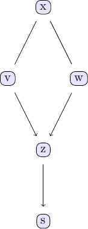

# Causalinference.jl

Julia package for causal inference, graphical models and structure learning.

This package contains code for the stable version of the PC algorithm and the extended FCI algorithm.

See the [documentation](https://mschauer.github.io/CausalInference.jl/latest/) for implemented functionality and [issue #1 (Roadmap/Contribution)](https://github.com/mschauer/CausalInference.jl/issues/1) for coordination of the development.

# FAQ

**Q:** I looked for "causal inference" and found [CausalInference.jl](.) and [Omega.jl](http://www.zenna.org/Omega.jl/latest/causal/)... 
**A:** CausalInference.jl is about causal discovery; you observe the data and want to infer the causal structure. Omega lets you reason what happens then: when you intervene ("do calculus") and want to cause changes.

