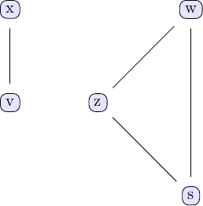
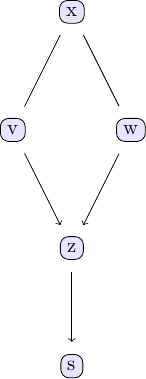

# CausalInference.jl

A Julia package for causal inference, graphical models and structure learning with the PC and FCI algorithms. This package contains for now the stable PC algorithm [`pcalg`](@ref) as well as the FCI algorithm as described by Zhang, 2008. 

The PC algorithm was tested on random DAGs by comparing the result of the PC algorithm using the *d*-separation oracle with the CPDAG computed with Chickering's DAG->CPDAG conversion algorithm (implemented as [`dsep`](@ref) and [`cpdag`](@ref) in this package).

See the [Library](https://mschauer.github.io/CausalInference.jl/latest/library/) for other implemented functionality.

The algorithms use the `SimpleGraph` and `SimpleDiGraph` graph representation of the Julia package [LightGraphs](https://github.com/JuliaGraphs/LightGraphs.jl).
Both types of graphs are represented by sorted adjacency lists (vectors of vectors in the LightGraphs implementation).

CPDAGs are just modeled as `SimpleDiGraph`s, where unoriented edges are represented by a forward and a backward directed edge.

## PC Algorithm: Basic Examples

A few example data sets can be useful to illustrate how to work with the PC algorithm and the different independence tests implemented in this package. The examples discussed here are based on the example models discussed in chapter 2 of Judea Pearl's book. The causal model we are going to study can be represented using the following DAG:


We can easily create some sample data that corresponds to the causal structure described by the DAG. For the sake of simplicity, let's create data from a simple linear model that follows the structure defined by the DAG shown above:

```Julia
# Generate some sample data to use with the PC algorithm

N = 1000 # number of data points

# define simple linear model with added noise
x = randn(N)
v = x + randn(N)*0.25
w = x + randn(N)*0.25
z = v + w + randn(N)*0.25
s = z + randn(N)*0.25

df = (x=x, v=v, w=w, z=z, s=s)
```

With this data ready, we can now see to what extent we can back out the underlying causal structure from the data using the PC algorithm. Under the hood, the PC algorithm uses repeated conditional independence tests to determine the causal relationships between different variables in a given data set. In order to run the PC algorithm on our test data set, we need to specify not only the data set we want to use, but also the conditional independence test alongside a p-value. For now, let's use a simple Gaussian conditional independence test with a p-value of 0.01. 

```Julia
est_g = pcalg(df, 0.01, gausscitest)
```

In order to investigate the output of the PC algorithm, this package also provides a function to easily plot and visually analyse this output.

```Julia
tp = plot_pc_dag(est_g, [String(k) for k in keys(df)])
```


The first thing that stands out in this plot is that only some edges have arrow marks, while others don't. For example, the edge going from `v` to `z` is pointing from `v` to `z`, indicating that that `v` influences `z` and not the other way around. On the other hand, the edge going from `x` to `w` has no arrows on either end, meaning that the direction of causal influence has not been identified and is in fact not identifiable based on the available data alone. Both causal directions, `x` influencing `w` and `w` influencing `x`, are compatible with the observed data. We can illustrate this directly by switching the direction of influence in the data generating process used above and running the PC algorithm for this new data set:

```Julia
# Generate some additional sample data with different causal relationships

N = 1000 # number of data points

# define simple linear model with added noise
v = randn(N)
x = v + randn(N)*0.25
w = x + randn(N)*0.25
z = v + w + randn(N)*0.25
s = z + randn(N)*0.25

df = (x=x, v=v, w=w, z=z, s=s)

plot_pc_dag(pcalg(df, 0.01, gausscitest), [String(k) for k in keys(df)])

```


We can, however, conclude unequivocally from the available (observational) data alone that `w` and `v` are causal for `z` and `z` for `s`. At no point did we have to resort to things like direct interventions, experiments or A/B tests to arrive at these conclusions!


## PC Algorithm: further examples

In the previous examples, we used a basic test data set to illustrate how to use the PC algorithm and how to visualise and interpret the results. The test data set was created using a simple linear model that followed the structure of the test DAG shown above. Depending on the field or discipline we are working in, we may encounter data sets whose components are not necessarily linearly related. It is hence worthwhile to analyse how the PC algorithm performs when working with more complex, nonlinear data sets:

```Julia
x = rand(Uniform(0,2π), N)
v = sin.(x) + randn(N)*0.25
w = cos.(x) + randn(N)*0.25
z = 3 * v.^2 - w + randn(N)*0.25 
s = z.^2 + randn(N)*0.25

df = (x=x,v=v,w=w,z=z,s=s)
```

The data set created above exhibits the same causal structure, but now the individual variables are related to each other in a (deliberately) nonlinear fashion. As before, we can run the PC algorithm on this data set using the Gaussian conditional independence test:

```Julia
plot_pc_dag(pcalg(df, 0.01, gausscitest), [String(k) for k in keys(df)])
```



Interestingly enough, the resulting graph bears no resemblance to the true graph we would expect to see. To understand what's happening here, we need to remind ourselves that the PC algorithm uses conditional independence tests to determine the causal relationships between different parts of our data set. It seems as if the Gaussian conditional independence test we are using here can't quite handle the nonlinear relationships present in the data (note that increasing the number of data points won't change this!). 
To handle cases like this, we implemented additional conditional independence tests based on the concept of [conditional mutual information (CMI)](https://en.wikipedia.org/wiki/Conditional_mutual_information). These tests have the benefit of being independent of the type of relationship between different parts of the analysed data. Using these tests instead of the Gaussian test is achieved by simply passing `cmitest` instead of `gaussci` as the conditional independence test to use to the PC algorithm:

```Julia
plot_pc_dag(pcalg(df, 0.01, cmitest), [String(k) for k in keys(df)])
```



The result of the PC algorithm using the CMI test again look like what we'd expect to see. 
It should be pointed out here that using `cmitest` is significantly more computationally demanding and takes **a lot** longer than using `gausscitest`.

## Performance

The speed of the algorithm is comparable with the C++ code of the R package `pcalg` after some pending optimisations.

## Contribution
See [issue #1 (Roadmap/Contribution)](https://github.com/mschauer/CausalInference.jl/issues/1) for questions and coordination of the development.

## References

* P. Spirtes, C. Glymour, R. Scheines, R. Tillman: Automated search for causal relations: Theory and practice. *Heuristics, Probability and Causality: A Tribute to Judea Pearl* 2010
* P. Spirtes, C. Glymour, R. Scheines: Causation, Prediction, and Search. *MIT Press* 2000
* J. Zhang: On the completeness of orientation rules for causal discovery in the presence of latent confounders and selection bias. *Artificial Intelligence* 16-17 (2008), 1873-1896
* T. Richardson, P. Spirtes: Ancestral Graph Markov Models. *The Annals of Statistics* 30 (2002), 962-1030
* D. M. Chickering: Learning Equivalence Classes of Bayesian-Network Structures. *Journal of Machine Learning Research* 2 (2002), 445-498.
* D. Colombo, M. H. Maathuis: Order-Independent Constraint-Based Causal Structure Learning. *Journal of Machine Learning Research* 15 (2014), 3921-3962.
